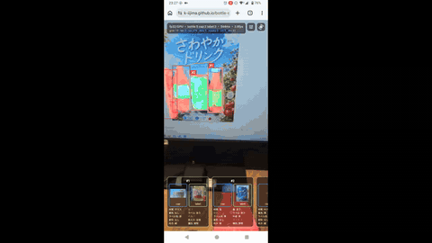

# bottle-seg-lite — だいたいのボトルをざっくり検出セグメンテーションするモデル

カメラ映像に ONNX モデルの検出・セグメンテーション結果をリアルタイム重畳する
**Flutter（Web / Android）** アプリと、その自作モデル（RTMDet-Ins-s、bottle/cap/label 3クラス）の
**データセット作成〜学習〜ONNX 化パイプライン**一式です。開発は Docker で完結します。

**🌐 ライブデモ: https://k-iijima.github.io/bottle-seg-lite/** （カメラ許可が必要。
main への push で GitHub Actions が自動ビルド・デプロイします）



フル画質版は [showcase/capture.mp4](showcase/capture.mp4)（720p 40秒 20MB）。

- **映像をとめない**: カメラ映像はネイティブ層で再生され、Dart/Flutter とは独立して描画されます。
  推論は非同期ループで動き、前フレームの推論が終わるまで新しいフレームは**スキップ**されるため、
  プレビューがモデルを待つことはありません。
- **モデル**: 自作データセットで学習した `RTMDet-Ins-s`。Releases からダウンロードするか、
  学習済み ckpt から `make rtmdet-onnx` で ONNX 化して配置します。
- **タップで追跡**: ボトルをタップするとトラック ID を付与して追跡（IoU 貪欲マッチング、
  15 フレーム連続ロストで破棄）。画面下部にトラックごとのキャップ/ラベル切り抜きパネルを
  固定表示します（`lib/tracking.dart`）。
- **10属性の推定**: 追跡中のボトルには 2 段目の軽量分類器（MobileNetV3-Small, 5MB）で
  材質/蓋/色/中身/変形等の 10 属性を推定し、パネルに日本語表示します。教師が Qwen3-VL の
  疑似ラベルのため精度は「対疑似ラベル再現度」（test mean macro-F1 0.681、
  [train/segmentation/TRAINING_LOG.md](train/segmentation/TRAINING_LOG.md) §8）。
  推定方法の詳細は「[仕組み](#仕組み要点)」参照。

## デモの試し方

**🌐 https://k-iijima.github.io/bottle-seg-lite/** （PC / スマホどちらでも。Chrome/Edge 推奨）

1. 開いてカメラを許可する（初回は COOP/COEP ヘッダ付与のため 1 回だけ自動リロードされます）
2. ボトルにカメラを向けると 赤=bottle / 青=cap / 緑=label のマスクと枠が重畳される
3. **ボトルをタップ**すると追跡開始。画面下部のパネルにキャップ/ラベルの切り抜きと
   **10属性（材質・蓋・蓋色・ラベル・ラベル色・中身・変形・見え方・向き・種別）** が出る
   - 属性は観測を貯めながら確定していくため、タップ直後は `?` が多め。**カメラを近づけて
     ボトルを大きく映す**ほど早く埋まる（小さく映っている間は推論しない仕様）
4. 追跡中のボトルを再タップで解除、ボトル以外をタップで全解除
5. 右上 🎛 で実行方式（fp32/GPU・WebNN・CPU・int8/CPU）、📷 でカメラを切替。
   左上チップに実行モード・検出数・ステージ別処理時間が出る

ローカルで動かす場合は下記「[使い方](#使い方)」（`make up` → http://localhost:8081 ）。

## 使用モデル・技術

推論はすべて**オンデバイス**（サーバ不要。モデルは初回ロードのみ）。

| 役割 | モデル / 技術 |
|---|---|
| 検出+インスタンスセグ | **RTMDet-Ins-s**（mmdetection v3.3）3クラス bottle/cap/label、入力320、mmdeploy で ONNX 化+前処理埋め込み。fp32 43MB / int8 12MB |
| 10属性分類（2段目） | **MobileNetV3-Small**（torchvision）+ 属性別10ヘッド、入力128、5MB。トラック内 EMA 集約+検出器と証拠融合 |
| 推論ランタイム | **ONNX Runtime** — Web: onnxruntime-web 1.27（WebGPU / WebNN / wasm）、Android: CPU EP。[flutter_onnxruntime](app/third_party/flutter_onnxruntime/README.local.md)（転送高速化の vendored パッチ入り） |
| アプリ | **Flutter**（Web / Android 共通コード）。カメラは getUserMedia / camera プラグイン |
| 疑似ラベル生成 | **SAM3**（box→mask 再生成+テキストプロンプトで cap/label 部位分離）、**Qwen3-VL-30B-A3B**（VQA で10属性付与） |
| データソース | COCO / LVIS / TACO / YouTube CC の21,612枚を統合 |
| 学習・検品 | PyTorch + mmdetection、RunPod（H100）、MLflow 記録、CVAT 検品 |

## 構成

```
bottle-seg-lite/
├─ docker-compose.yml        # rtmdet-onnx/seg/apk(ツール) と web(devサーバ)
├─ docker-compose-cvat.yml   # アノテーション検品用 CVAT（make cvat-up）
├─ Makefile                  # make up / make apk / make rtmdet-onnx など
├─ model/
│  └─ rtmdet/                #  学習済み RTMDet-Ins-s の ONNX 化（mmdeploy、GPU 必須）
├─ app/                      # Flutter アプリ（Web + Android）
│  ├─ web/index.html         # onnxruntime-web の <script> を読み込み
│  └─ lib/
│     ├─ camera_view_web.dart    # getUserMedia + 非ブロッキング推論ループ
│     ├─ camera_view_mobile.dart # camera プラグイン（YUV420→RGBA+回転補正）
│     ├─ detector.dart           # RTMDet-Ins 前処理/推論/後処理
│     ├─ attr_classifier.dart    # ボトル10属性の分類器 + トラック内 EMA 集約
│     ├─ tracking.dart           # タップ追跡（IoU マッチング）+ cap/label 切り抜き
│     └─ overlay_paint.dart      # マスク・枠の重畳描画 + 属性パネル
└─ train/segmentation/       # データセット作成〜学習パイプライン（下記）
```

## 学習パイプライン（train/segmentation/）

bottle データセット（21,612枚 / COCO+LVIS+TACO+YouTube CC、SAM3 による 3クラスマスク +
Qwen3-VL による bottle 属性10種）の作成と、RTMDet-Ins-s の学習（test segm_mAP 0.352。
評価の正解も SAM3 生成アノテーションのため、この値は人手正解に対する精度ではなく
**SAM3 疑似ラベルの再現度**）。
データセット本体・学習成果物は git 管理外。

- データセット仕様: [train/segmentation/DATASET.md](train/segmentation/DATASET.md)
- 作業ログ・経緯: [train/segmentation/DATASET_STATUS.md](train/segmentation/DATASET_STATUS.md)
- 学習記録と知見（lr/NCCL/mmcv のハマりどころ）: [train/segmentation/TRAINING_LOG.md](train/segmentation/TRAINING_LOG.md)
- SAM3 ローカル実行: [train/segmentation/README_SAM3_local.md](train/segmentation/README_SAM3_local.md)
- CVAT 検品: [train/segmentation/README_CVAT.md](train/segmentation/README_CVAT.md)
- RunPod フリート運用: [train/segmentation/runpod/README_RUNPOD.md](train/segmentation/runpod/README_RUNPOD.md)

シークレットは `.env` に置く（`.env.example` をコピーして作成。git 管理外）。

## 学習済みモデル（GitHub Releases）

学習済みモデルは [Releases](https://github.com/k-iijima/bottle-seg-lite/releases) からダウンロードできます
（検出は test segm_mAP 0.352 = 対 SAM3 疑似ラベル再現度、属性は test mean macro-F1 0.681 =
対 Qwen3-VL 疑似ラベル再現度。ONNX I/O 仕様はリリースノート参照）。

| ファイル | 配置先 / 用途 |
|---|---|
| `rtmdet_ins.onnx` | `app/assets/models/rtmdet_ins.onnx` に置くと Flutter アプリで推論可能 |
| `rtmdet_ins_int8.onnx` | 同ディレクトリに置くと 🎛 メニューの int8/CPU モードが使える（省略可） |
| `attr_cls.onnx` | 同ディレクトリに置くとタップ追跡時に 10 属性が表示される（省略時は検出のみで動作） |
| `best_coco_segm_mAP_epoch_60.pth` | `train/segmentation/work_pet_bottle/` に置くと `make rtmdet-onnx` で再エクスポート可能（**v0.1.0 にのみ添付**。以降の ONNX も同じ ckpt からのエクスポート） |

```bash
gh release download v0.3.0 -R k-iijima/bottle-seg-lite -p '*.onnx' -D app/assets/models
```

## 必要なもの

- Docker / Docker Compose
- カメラ付き端末と、`localhost` でアクセスできるブラウザ（Chrome/Edge 推奨）

> getUserMedia は**セキュアコンテキスト**が必要です。`http://localhost:8081`（localhost）は
> セキュア扱いなので HTTPS なしで動きます。別マシンの IP で開く場合は HTTPS が必要です。

## 使い方

```bash
# 1) 学習済みモデルを配置（初回のみ。上記「学習済みモデル」の gh release download を実行）

# 2) 開発サーバ起動（初回はイメージ build + pub get で数分かかります）
make up
```

起動後、ブラウザで **http://localhost:8081** を開き、カメラ許可を与えてください
（コンテナ内は 8080、ホスト側は 8081 に公開。docker-compose.yml 参照）。
左上に状態と 1フレームあたりの推論時間(ms)が表示されます。

停止は `Ctrl-C` もしくは別ターミナルで `make down`。

`make` を使わない場合:

```bash
docker compose up --build web                    # = make up
```

## Android で動かす

モデル配置（上記「学習済みモデル」）後に APK をビルドし、端末に転送してインストールします:

```bash
make apk   # 出力: app/build/app/outputs/flutter-apk/app-release.apk（全 ABI 同梱 138MB）
```

- ストア外+デバッグ署名のため Play プロテクトの警告が出ますが、そのままインストールで動作します
- 推論は CPU EP で約 200〜400ms/frame（Xperia SOG10 実測。実機で踏んだ問題と対策は
  [train/segmentation/TRAINING_LOG.md](train/segmentation/TRAINING_LOG.md) §6）
- arm64 端末のみ対象なら `flutter build apk --split-per-abi` で約 70MB に削減可能

## 仕組み（要点）

- `camera_view_web.dart`
  - `getUserMedia` で `MediaStream` を取得し `<video>` に流す → `HtmlElementView` で表示。
  - オフスクリーン `<canvas>` に `drawImage` で**モデル入力解像度へ縮小**して描画し、
    `getImageData` で RGBA を取得。
  - `_loop()` が非同期に回り、`_running` フラグで多重実行を防止（=フレームスキップ）。
  - 推論結果のオーバーレイ(RGBA)を `decodeImageFromPixels` で `ui.Image` 化し、`CustomPaint` で
    `object-fit: cover` に合わせて重畳。
- `detector.dart`
  - 前処理はモデル内蔵: uint8 RGBA NHWC を直渡し（RGBA→BGR・mean/std 正規化は
    `model/rtmdet/embed_preprocess.py` が ONNX グラフ先頭に埋め込み済み）。
  - 推論: `flutter_onnxruntime` の `OrtValue.fromList` / `session.run`（Web では index.html の
    `onnxruntime-web` を利用）。
  - 後処理: `dets`/`labels`/`masks` をスコア閾値で選別し、クラス色のマスク+枠を描画。
- `attr_classifier.dart`（`assets/models/attr_cls.onnx`）
  - 追跡中ボトルのクロップ（元解像度から bbox+15% pad、長辺 96px 以上のみ）を
    低頻度（0.7〜1s/トラック）で切り出して 128×128 で推論し、トラック内で softmax を
    EMA 集約（確信度不足は `?` 表示。2値属性は閾値 0.65）。蓋・ラベル有無は検出器の
    cap/label パーツ検出を証拠として融合（あり=強め/なし=弱めの非対称重み）。
  - ⚠️ ort-web は同一 wasm モジュール上の並行 `run()` 不可（"Session already started"）
    のため、属性推論は検出と**直列**に実行する。
- `web/index.html` に
  `https://cdn.jsdelivr.net/npm/onnxruntime-web@1.27.0/dist/ort.min.js` を読み込み（必須）。

## 自作モデルへの差し替え方

1. ONNX の入出力を以下に合わせる（または `lib/detector.dart` の定数を変更）:
   - 入力 `input`: uint8 `[1,S,S,4]` NHWC RGBA（前処理埋め込み後の契約。mmdeploy 出力
     （float32 BGR NCHW）には `model/rtmdet/embed_preprocess.py` を適用して変換する）
   - 出力 `dets` `[1,K,5]` / `labels` `[1,K]` / `masks` `[1,K,S,S]`（mmdeploy の RTMDet-Ins 形式）
2. `.onnx` を `app/assets/models/rtmdet_ins.onnx` に置く（学習済み ckpt からの
   再エクスポートは `make rtmdet-onnx`）。
3. クラス数・配色・スコア閾値が違う場合は `detector.dart` を調整。

## パフォーマンス（Web）

以下は実装済み（RTX 4060 Laptop 実測: WebGPU 115ms/8fps、WebNN 44ms/20fps）:

- **入力 320・前処理モデル内蔵**: 入力は uint8 RGBA NHWC で canvas の
  getImageData を直渡し（RGBA→BGR・正規化は `embed_preprocess.py` が
  ONNX グラフ先頭に埋め込み）。
- **転送ゼロコピー化**: flutter_onnxruntime の Web 実装が 1 要素ずつの
  interop 変換でボトルネックだったため、vendored パッチで一括変換に修正
  （`app/third_party/flutter_onnxruntime/README.local.md`）。
- **パイプライン化+ボックス外挿**: マスク合成/デコードは次フレームの推論と
  並行実行。枠はベクタ描画で、検出間は直近 2 検出からの線形外挿で 33ms ごと
  に追従更新（上限 300ms）。
- **WebGPU 実行プロバイダ**（既定）: 非対応ブラウザでは ort-web が自動で wasm にフォールバック。
- **WebNN（実験・要ブラウザフラグ）**: chrome://flags で WebNN を有効化して
  メニューから選択。ネイティブ ML ランタイム（Windows は DirectML）直結のため
  WebGPU 比 3〜4 倍速い。将来ブラウザ既定有効になれば昇格予定。
- **マルチスレッド WASM**: GitHub Pages はヘッダを付与できないため
  `web/coi-serviceworker.js` が COOP/COEP を注入して SharedArrayBuffer を有効化
  （初回アクセス時に 1 回自動リロード。Flutter の SW と衝突するためビルドは
  `--pwa-strategy none`）。
- **int8 量子化モデル**（43MB→12MB）: `make rtmdet-onnx` 後に
  `python model/rtmdet/quantize_int8.py` で生成。感度の高い層
  （SE-attention / backbone stage2.1 blocks.0）は除外済み。
- **右上 🎛 メニュー**で fp32/GPU・fp32/WebNN・fp32/CPU・int8/CPU を実行中に切替可能
  （int8×GPU は ort-web の WebGPU が per-channel DequantizeLinear 未対応のため提供しない。
  fp16×WebGPU は速度向上がなく box 座標が壊れるため非提供、変換スクリプトのみ
  `model/rtmdet/convert_fp16.py` に残置）。
  ステータスチップ左端に実行中モードを常時表示（例: `fp32/WebNN`、
  フォールバック時は `fp32/GPU→CPU×8`）。

Android は CPU EP（4 スレッド）。NNAPI / XNNPACK はこのモデル
（uint8 NHWC 入力+動的 shape 後処理）でセッション作成中に SIGABRT する
組み合わせ問題があり不使用（detector.dart のコメント参照）。

さらに下げたい場合は入力解像度を落として再エクスポート
（`export_rtmdet.sh` の `SIZE` と `Detector(inputSize:)` を一致させる）。

## ライセンス

[MIT](LICENSE)。vendored している
[flutter_onnxruntime](app/third_party/flutter_onnxruntime/LICENSE) も MIT です。
データセット画像の出典・ライセンス上の注意は
[train/segmentation/DATASET.md](train/segmentation/DATASET.md) §7 を参照してください。
